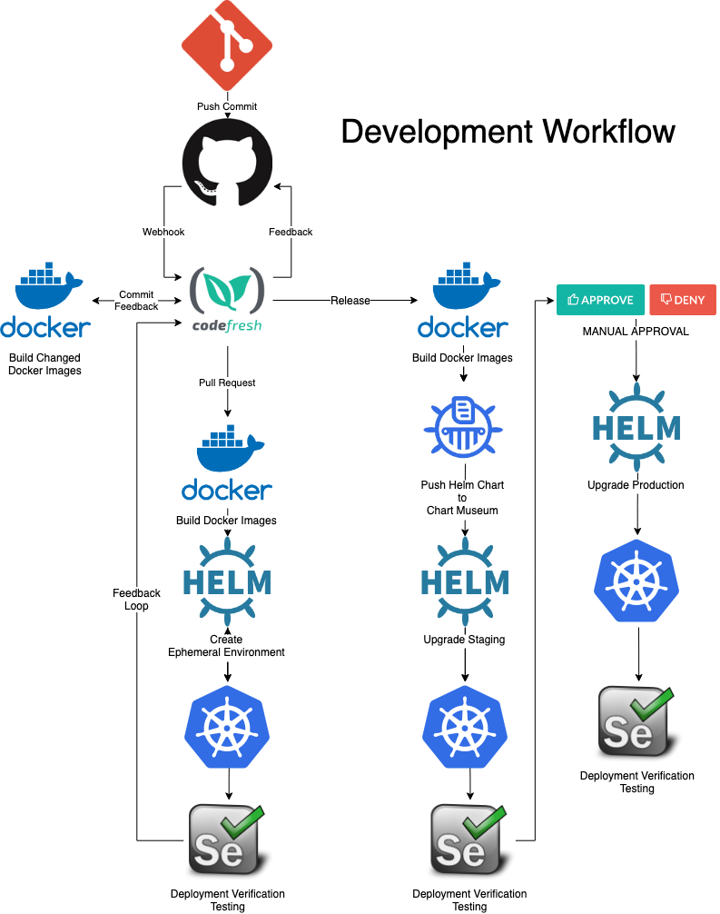

!!!REWRITE UNDERWAY PLEASE DO NOT FORK OR USE IN CURRENT STATE!!!

PreReqs:

* [Codefresh Account](https://g.codefresh.io/signup)
* [Kubernetes cluster](https://kubernetes.io/) (External LB*) (Options**)
* [GitHub Context](https://codefresh.io/docs/docs/integrations/git-providers/#github) (named github)

Only one example-voting-app demo per Kubernetes cluster.
If you absolutely must share update the release names with your personal
  - Find and prepend your user/org info (shortname) to the following values in `.codefresh/codefresh-cd.yml`:
    - `${{CF_BRANCH_TAG_NORMALIZED}}-${{CF_PULL_REQUEST_NUMBER}}-${{CF_REPO_NAME}}`
    - `staging-example-voting-app`
    - `production-example-voting-app` 
    
    with unique prepended value like...
    - `dustinvb-${{CF_BRANCH_TAG_NORMALIZED}}-${{CF_PULL_REQUEST_NUMBER}}-${{CF_REPO_NAME}}`
    - `dustinvb-staging-example-voting-app`
    - `dustinvb-production-example-voting-app`

This pipeline will create Helm Releases in a few ways.
Every PR gets a new release just create a branch and a PR back to your forker repository.
Staging and Production both get a release and are long-lived environments.
They are triggered by creating a new GitHub Release.
After staging deploys successfully you will be prompted to Approve the release to Production.

*External LB Requirements:

6-10 External Ephemeral IPs required for normal usage from Cloud provider

2 External IPs Required per running example-voting-app release.

**Some popular Kubernetes options

* [Amazon KOPs](https://github.com/kubernetes/kops) [Tutorial](https://codefresh.io/kubernetes-tutorial/tutorial-deploying-kubernetes-to-aws-using-kops/)
* [Amazon EKS (Preview)](https://aws.amazon.com/eks/)
* [Azure Container Service (Moving to AKS)](https://docs.microsoft.com/en-us/azure/container-service/kubernetes/container-service-kubernetes-walkthrough)
* [Azure Kubernetes Service (Preview)](https://docs.microsoft.com/en-us/azure/aks/) [Webinar](https://codefresh.io/webinars/devops_kubernetes_helm/)
* [Google Kubernetes Engine](https://cloud.google.com/kubernetes-engine/) [Tutorial](https://codefresh.io/kubernetes-tutorial/get-first-app-running-kubernetes-codefresh-google-container-engine/)
* [IBM Cloud Container Service](https://www.ibm.com/cloud/container-service)
* [Stackpoint Cloud](https://stackpoint.io/)

If wanted, Allure is supported and step is there just setup Storage Integration and uncomment the step in cd.yml

[Storage Integration](https://codefresh.io/docs/docs/testing/test-reports)

Now onto the How-to!
----

Fork this [Github Repository](https://github.com/codefresh-contrib/example-voting-app)
----
Either [Fork](https://help.github.com/articles/fork-a-repo/) or copy this repositories content to your Github Account or a GIT repository in another Version Control System.


Make sure you have complete pre-reqs
----

1. Add your forked GitHub Repository to Codefresh through UI
1. Make any modifications to YAML files you need to make like the release names (explained above)
1. Modify the GIT trigger for `example-voting-app` pipeline adding this Branch Regex `/one-time-build/gi`.
1. Build `example-voting-app` pipeline selecting `Advanced Options` and specifying name of your Kubernetes cluster `KUBERNETES_CLUSTER_NAME` as shown in Codefresh and the Kubernetes namespace `KUBERNETES_NAMESPACE` to deploy `example-voting-app` releases to (this namespace is created automatically by pipeline and must not exist before hand).  This is a one-time operation and not idempotent at this time.

Now you can play with the release or do something similar with your own application.



To generate staging release simply add a new GitHub Release to your forked repository.

To generate production release approve that pipeline to continue on.

PRs generate PR release based on PR information.

ORIGINAL DOCUMENTATION FROM SOURCE REPOSITORY
=========

Example Voting App
=========

Getting started
---------------

Download [Docker](https://www.docker.com/products/overview). If you are on Mac or Windows, [Docker Compose](https://docs.docker.com/compose) will be automatically installed. On Linux, make sure you have the latest version of [Compose](https://docs.docker.com/compose/install/). If you're using [Docker for Windows](https://docs.docker.com/docker-for-windows/) on Windows 10 pro or later, you must also [switch to Linux containers](https://docs.docker.com/docker-for-windows/#switch-between-windows-and-linux-containers).

Run in this directory:
```
docker-compose up
```
The app will be running at [http://localhost:5000](http://localhost:5000), and the results will be at [http://localhost:5001](http://localhost:5001).

Alternately, if you want to run it on a [Docker Swarm](https://docs.docker.com/engine/swarm/), first make sure you have a swarm. If you don't, run:
```
docker swarm init
```
Once you have your swarm, in this directory run:
```
docker stack deploy --compose-file docker-stack.yml vote
```

Run the app in Kubernetes
-------------------------

The folder k8s-specifications contains the yaml specifications of the Voting App's services.

Run the following command to create the deployments and services objects:
```
$ kubectl create -f k8s-specifications/
deployment "db" created
service "db" created
deployment "redis" created
service "redis" created
deployment "result" created
service "result" created
deployment "vote" created
service "vote" created
deployment "worker" created
```

The vote interface is then available on port 31000 on each host of the cluster, the result one is available on port 31001.

Architecture
-----


* A Python webapp which lets you vote between two options
* A Redis queue which collects new votes
* A .NET worker which consumes votes and stores them in…
* A Postgres database backed by a Docker volume
* A Node.js webapp which shows the results of the voting in real time


Note
----

The voting application only accepts one vote per client. It does not register votes if a vote has already been submitted from a client.
